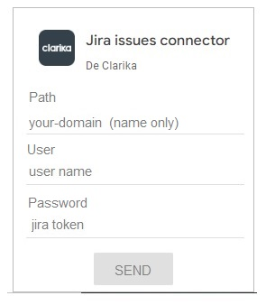

# Jira Community Connector for Data Studio

This [Data Studio] [Community Connector] lets issues from jira with the possibility of filtering by project and by a given date range.

## Set up the Community Connector for personal use

To use this Community Connector in Data Studio there is a one-time setup to
deploy your own personal instance of the connector using Apps Script. The
connector also requires additional setup in Jira to get an authentication token.

### 1. Deploy the connector

Follow the [deployment guide] to deploy the Community Connector.

Make a note of the Script ID for the connector, you'll need it for the next
step.

- To find your Script ID, Visit [Apps Script], then click on
  **File** -> **Project Properties**, and you'll see the id under the **Info**
  tab.

### 2. Configuration

Visit [Apps Script] and open your Jira connector Apps Script project.
Click on **File** -> **Project Properties** -> **Script Properties**.
Add key-value pairs as script properties:

   Key                   | Value
   ----------------------|----------------------   
    `FORMAT_DATE`        | {SHORT FORMAT DATE} (dd/mm/yyy, mm/dd/yy, yyyy.mm.dd, etc.)    
    `LANG`               | {LANGUAGE} (es-AR, en-US, etc.)

Default values are: dd/mm/yyyy and es-AR 

### 2. Authentication

The connector require authentication token. Follow the steps below to
complete the connector setup:

1.  Visit the https://(your-domain).atlassian.net/jira/your-work.

2.  In your Jira account, select the account management option. 
    Then, in the security menu select the option **Create and manage API tokens**.   
   
3. Using the information obtained from Jira to Init authentication in your connector

   

### About connector files

**appsscript.json** -> json file with general info about this connector
 
**main.gs** -> script that implement methods from data studio connector interfaz
 
**auth.gs** -> script that implement methods to authentication user
 
**config.gs** -> script that implement methods to configuration of connector
 
**schema.gs** -> script that describe data schema of connector
 
**data.gs** -> script that contains functions for data acquisition from the jira api
 
**support.gs** -> general purpose functions

### Functions created in data studio with the connector data

Deviation in days: DATE_DIFF(Sprint Complete,Sprint End) 
 
Percentage of completion: AVG(Story Points/Puntos Finalizados)
 
Finished points: if(State="UAT",Story Points,0), IF(State='Finalizada'and Extend= False,Story Points,0)
 
Days without release: DATE_DIFF(TODAY(),Project Release Date)
 
Days without time registration: DATE_DIFF(TODAY(),Tempo Date)

[Data Studio]: https://datastudio.google.com
[Community Connector]: https://developers.google.com/datastudio/connector
[Jira API]:https://developer.atlassian.com/cloud/jira/platform/rest/v3/intro/
[Apps Script]: https://script.google.com
[Use a Community Connector]: https://developers.google.com/datastudio/connector/use
